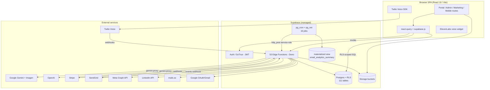
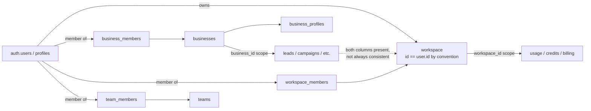
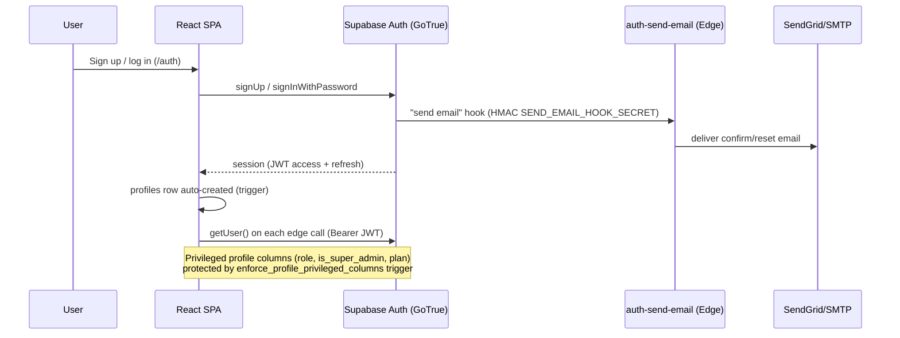
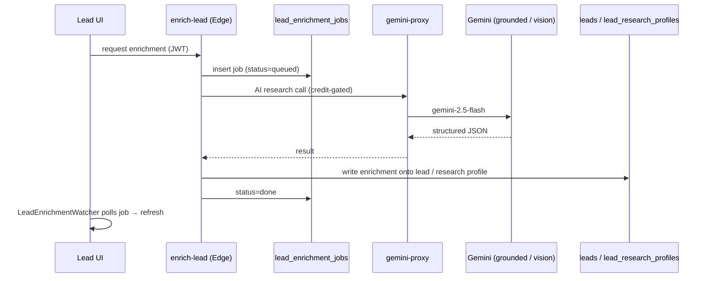
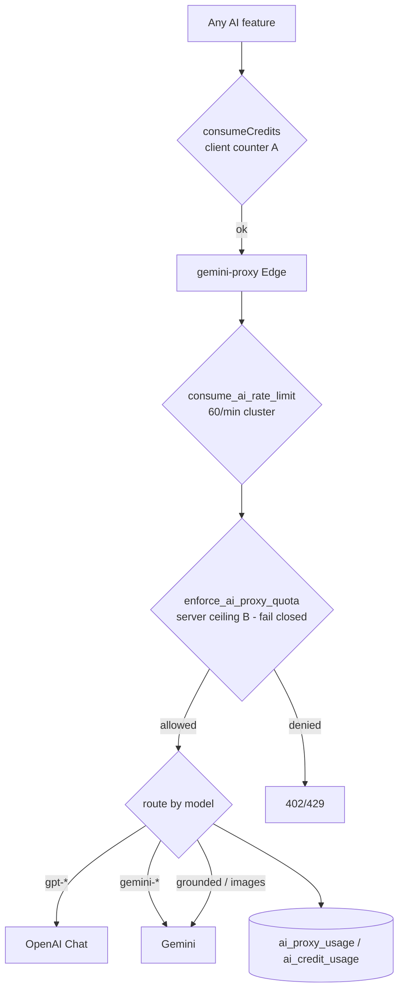
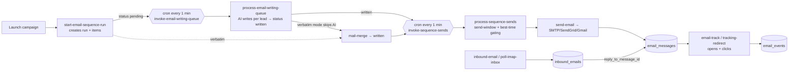
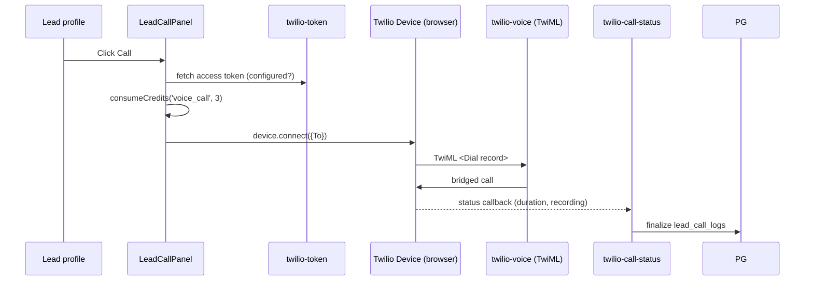

# Scaliyo — System Architecture

> Branch `master` · commit `d8e1762` · analysed 2026-07-16. Read-only review. No secret values included.

## 1. Technology Stack

| Layer | Technology | Notes |
|---|---|---|
| Frontend | React 19.2 + TypeScript + Vite 6 | SPA, lazy-loaded routes (`lazyWithRetry`), Tailwind CSS |
| Routing | react-router-dom 7 | Marketing / portal / admin / mobile route trees (`AuraEngine/App.tsx`) |
| Data fetching | @tanstack/react-query 5 + direct `supabase-js` | Mixed — many pages query Supabase directly |
| State | React context providers (Business/Workspace/Auth) + local state | No Redux |
| UI libs | lucide-react (icons), recharts (charts), @dnd-kit (Team Hub kanban), react-markdown | |
| Backend | Supabase Edge Functions (Deno, TypeScript) | 53 functions in `supabase/functions/` |
| Database | Supabase Postgres (managed) | 111 tables, 105 functions/RPCs, 331 RLS policies, 207 indexes, 210 FKs, 1 materialized view |
| Auth | Supabase Auth (GoTrue) | JWT; custom "send email" auth hook (`auth-send-email`) |
| File storage | Supabase Storage | Buckets: `social_media`, `blog-assets`, `media_assets`, `image-gen-assets` |
| AI | Google Gemini (2.5-flash, 3-flash-preview, Imagen 4) + OpenAI (routing supported) | via provider-aware `gemini-proxy` |
| Payments | Stripe (Checkout + Billing + Invoices) | |
| VOIP | Twilio Programmable Voice + Voice JS SDK | dormant until secrets set |
| Voice widget | ElevenLabs conversational agents | site-navigation assistant (NOT a call co-pilot) |
| Email | SendGrid (auth/system) + per-workspace SMTP/SendGrid/Gmail/Mailchimp (outreach) | |
| Email validation | mails.so | |
| Error monitoring | Sentry (@sentry/react) | `VITE_SENTRY_DSN` |
| Scheduling | pg_cron + pg_net (16 scheduled jobs) | |
| Hosting | VPS (Ubuntu 24.04) + Nginx 1.24, HTTP/2, Let's Encrypt | zero-downtime symlink deploy via GitHub Actions |

## 2. High-Level System Architecture



**Important structural note:** there is a duplicated backend tree. Canonical edge functions live in `supabase/functions/`. A stale copy exists under `AuraEngine/supabase/` — treat `supabase/functions/` as source of truth.

## 3. Multi-Tenancy Architecture (the central architectural risk)

Scaliyo carries **three overlapping tenancy models** that are only partially reconciled:

| Model | Tables | Guard function | Where used |
|---|---|---|---|
| **Business** | `businesses`, `business_members`, `business_profiles` | `is_business_member(business_id)`, `is_business_admin(business_id)` | The v2 "multi-business re-scope"; most lead/campaign RLS scopes by `business_id` |
| **Workspace** | `workspaces`, `workspace_members`, `workspace_invites`, `workspace_entitlements` | `is_workspace_member(ws_id)` | Billing, AI-credit metering, usage counters |
| **Team** | `teams`, `team_members`, `team_invites` | `is_team_member(team_id)` | Team Hub collaboration boards |

The pragmatic MVP convention is **`workspace_id == user.id`** (a user's workspace id equals their auth uid). Many code paths (`start-email-sequence-run`, `billing-webhook`, `workspace_ai_usage` RLS) assume this, while others resolve `workspace_id` from `workspace_members`. These agree **only** while every user has exactly one workspace whose id is their uid. The multi-business re-scope makes `workspace_id` NOT NULL on many tables without a default, which has repeatedly broken code that forgets to set it (see `BUGS_AND_TECHNICAL_DEBT.md`). **Reconciling these three models into one canonical tenant boundary is the #1 architectural priority.**



## 4. Authentication Flow



Admin gating: `profiles.role = 'ADMIN'` (via `is_admin()`), super-admin adds `is_super_admin = true`. Support staff can access a target user's data only through a time-boxed `support_sessions` row (`has_active_support_session`).

## 5. Lead Enrichment Flow (server-side background job)



The job survives navigation/reload because state lives in `lead_enrichment_jobs`, not the client.

## 6. AI Request Flow (provider-aware proxy + dual credit enforcement)



- **Counter A** (`workspace_ai_usage`, client-side, bypassable) is the honest-client meter.
- **Counter B** (`ai_proxy_usage`, server-side, `service_role` only, fails closed) is the real anti-abuse ceiling.
- Some functions call Gemini **directly** (not via the proxy): `process-email-writing-queue`, `preview-sequence-email`, `enrich-lead`, `_shared/goal-steps/gemini.ts`. Those bypass Counter B and must be watched for retired-model / thinking-truncation bugs (recently fixed on 2 of them).

## 7. Email Sending Flow (3-stage cron pipeline)



## 8. Social Publishing Flow

```mermaid
flowchart LR
  Comp[SocialScheduler composer] --> SN[social-post-now]
  Comp --> SS[social-schedule → status scheduled]
  SS --> CR{{cron every 5 min<br/>social-run-scheduler}}
  CR --> Claim[claim_due_social_posts]
  Claim --> Pub[publish helpers]
  SN --> Pub
  Pub -->|Facebook| FB[Graph v21 /feed /photos]
  Pub -->|Instagram| IG[container → publish]
  Pub -->|LinkedIn| LI[/v2/ugcPosts]
  Pub --> Targets[(social_post_targets)]
  Note[TikTok: not implemented]
```

**Production reality:** OAuth apps are unconfigured, so `social_accounts` are all `demo_token` rows and every publish attempt fails at the real API. Code is correct; credentials/app-review are missing.

## 9. VOIP Flow



Inbound: `twilio-incoming` rings online browsers (presence in `voip_inbound_routes`), falls back to `twilio-voicemail` when nobody is online. **No AI call assistance / transcription exists.** Webhook signature verification is missing on incoming/status/voicemail endpoints.

## 10. Background Jobs (pg_cron, 16 scheduled)

| Job | Schedule | Purpose |
|---|---|---|
| `invoke-email-writing-queue` | every 1 min | AI-write pending sequence items |
| `invoke-sequence-sends` | every 1 min | send written items (window/best-time gated) |
| `webhook-dispatcher` | every 1 min | deliver queued outbound webhooks |
| `invoke-imap-poll` | every 5 min | poll IMAP inboxes for replies |
| `social-run-scheduler` | every 5 min | publish due social posts |
| `resume-paused-goals` | every 5 min | automation goal resume |
| `invoke-ab-autopause` | every 15 min | A/B winner auto-optimize |
| `refresh-email-analytics` | every 10 min | refresh `email_analytics_summary` MV |
| `refresh-sender-health` | :22 hourly | sender deliverability health |
| `campaign-memory-outcome-sweep` | :17 hourly | roll campaign outcomes into memory |
| `observe-goal-drift` | :37 hourly | detect automation-goal drift |
| `auto-replan-drifting-goals` | :47 hourly | goal-replanner |
| `relearn-best-send-hours` | every 6h | recompute per-lead best send hour |
| `purge-api-idempotency` / `purge-*-rate-limit-buckets` | hourly | GC internal tables |

## 11. Webhooks, Realtime, Caching, Analytics

- **Inbound webhooks:** Stripe (`billing-webhook`), SendGrid (`webhooks-sendgrid`), Mailchimp (`webhooks-mailchimp`), Twilio (voice/incoming/status/voicemail), inbound email (`inbound-email`). **Inbound signature verification is largely ineffective:** Stripe fails **open** when the secret is unset; SendGrid uses HMAC-SHA256 where SendGrid actually signs **ECDSA** (never verifies); Mailchimp checks a header Mailchimp doesn't send; most Twilio endpoints are **unauthenticated**. Effectively, all inbound webhooks can be spoofed. (Outbound webhooks, by contrast, are correctly HMAC-signed.)
- **Outbound webhooks:** `webhook_endpoints` + `webhook_deliveries` + `webhook-dispatcher` (fan-out via `queue_webhook_event`, canonical events: lead.created/updated, sequence.completed, email.sent/bounced/spam_complaint/unsubscribed).
- **Realtime:** No heavy use of Supabase Realtime channels observed; polling patterns dominate (enrichment watcher, VOIP presence heartbeat, job pollers).
- **Caching:** No dedicated cache layer (no Redis). react-query provides client cache; `email_analytics_summary` materialized view is the analytics cache.
- **Analytics/logging:** tracking pixels + link redirects → `email_events`/`tracking_events`; Sentry for frontend errors; `audit_logs` + `support_audit_logs` for security events; per-op AI logs in `ai_credit_usage`/`ai_proxy_usage`/`ai_usage_logs`.

## 12. Deployment & Environments

- Frontend built by Vite, deployed via GitHub Actions to a VPS with an atomic symlink swap (`/var/www/scaliyo/current` → latest release, keep last 5). Nginx serves the SPA + proxies.
- Edge functions deployed with `supabase functions deploy`; webhooks with `--no-verify-jwt`.
- Migrations applied with `supabase db push --linked` (152 migration files).
- Secrets are Supabase function secrets / VPS env, never in the repo. Live URL: https://scaliyo.com.

## 13. Security Boundaries (summary — see SECURITY_AND_PRIVACY_AUDIT.md)

- **Trust boundary 1:** browser → Postgres is guarded by RLS (331 policies; only the 2 internal rate-limit-bucket tables lack RLS). Privileged profile columns are trigger-protected against self-escalation.
- **Trust boundary 2:** browser → edge functions authenticate the JWT and mostly owner-scope writes; the **real** AI/credit enforcement is server-side (`enforce_ai_proxy_quota`). Client-side credit checks and client-supplied Stripe price/credit amounts are **not** a security boundary (tampering risks — P0/P1). **Critically, the `admin_*` RPCs are NOT a trust boundary either** — they authorize on a caller-supplied admin id and are executable by `anon` (P0). SECURITY DEFINER RPCs must authorize on `auth.uid()`, not parameters.
- **Trust boundary 3:** external webhooks — mostly signature-verified, except Twilio endpoints and Stripe-when-secret-unset (fail-open).
