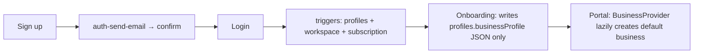
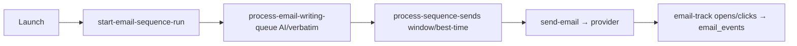

# Scaliyo — User Workflows (end-to-end)

> Traced UI → handler → API/RPC → DB → external. Status legend: ✅ works · ⚠️ partial · 🔴 broken/missing.

## 1. Registration & Onboarding ✅ (onboarding ⚠️ cosmetic)
- **Trigger:** `/signup` or `/auth`.
- **Steps:** enter email/password (or Google/GitHub OAuth) → confirm email → log in.
- **System:** `supabase.auth.signUp` → GoTrue → `auth-send-email` hook (HMAC) → SendGrid/SMTP confirmation. On first `auth.users` insert, triggers `handle_new_user` (creates `profiles` role=CLIENT, 500 credits, + `subscriptions`) and `handle_new_user_workspace` (creates `workspaces` with id=user.id + owner `workspace_members`).
- **DB:** `auth.users`, `profiles`, `subscriptions`, `workspaces`, `workspace_members`.
- **Notifications:** confirmation/reset email.
- **Success:** session issued; redirect ADMIN→`/admin`, else `/portal`.
- **Failure:** existing account detected via empty `identities`; profile-read retried 5× to survive trigger lag.
- **Onboarding (`/onboarding`):** 4 steps capture role/company/goal; the "Setting up your workspace" step is a **pure animation** — provisions nothing. On finish it sets a **localStorage** flag and fire-and-forgets `{companyName,…}` into `profiles.businessProfile` JSON.
- **Missing/UX:** onboarding creates no business/workspace (the first business is auto-created lazily by `BusinessProvider`); completion flag is localStorage → onboarding reappears on a new device; "Remember me" and Terms checkboxes are decorative.

## 2. Creating the first business ✅ (auto) / 3. Adding another business ✅
- **Trigger:** first portal load (auto) or `/portal/businesses` → "New business".
- **System:** `BusinessProvider` calls `get_or_create_default_business`; manual create calls `create_business` RPC (atomic: `businesses` + owner `business_members` + empty `business_profiles`), `SECURITY DEFINER`, checks `is_workspace_member`.
- **DB:** `businesses`, `business_members`, `business_profiles`.
- **Success:** business appears in switcher.
- **⚠️ Missing:** with the `multi_business` flag **off (default)**, switching businesses **does not filter data** (honest banner warns of this). Business scoping is inert until the flag is enabled.

## 4. Inviting team members 🔴 BROKEN
- **Trigger:** intended from Team Hub / Strategy Hub.
- **Reality:** **No working send path exists** for either team system. `teamhub_invites` has an insert path but `acceptInvite` is never called by any UI and there's no email. `team_invites` can be *accepted* (`GlobalInviteBanner`) but **nothing creates them** in-app. Accepting a Strategy-Hub invite grants `team_members` but **zero** Team Hub access → the collaborate journey dead-ends.
- **DB:** `teams`, `team_members`, `team_invites`, `teamhub_invites`, `teamhub_flow_members`.
- **Missing:** invite-send UI, email delivery, server-side accept, reconciliation of the two team systems. `workspace_invites` is orphaned.

## 5. Finding a lead 🔴 MISSING
- **Reality:** there is **no lead-discovery/data-provider integration**. The "search" box on `/portal/leads` is a local in-memory filter. "Apollo" is dead scaffolding (`apollo_*` log tables, enum entries) — no provider API is ever called.
- **Missing:** a real provider (Apollo/PDL/etc.) wired to the existing `jobs`/`apollo_*` infra.

## 6. Importing leads ✅
- **Trigger:** `/portal/leads` → Import wizard (CSV/XLSX).
- **Steps:** upload → `autoMapColumns` (regex header map, incl. Website + multi-email) → confirm → import.
- **System:** `leadImporter.executeImport` chunks 500 rows → `import_leads_batch` RPC (plan contact caps, dedupe by email then linkedin, merge/overwrite/skip, multi-email split into `emails[]`, `needs_enrichment` flag).
- **DB:** `leads`, `import_batches`, `audit_logs`.
- **Success:** batch summary; leads visible.
- **⚠️ Missing:** import does **not** trigger scoring/enrichment — new leads land at `score=0`.

## 7. Enriching a lead ✅ (durable background job)
- **Trigger:** lead profile "Enrich" or bulk enrich.
- **System:** `enrich-lead` verifies ownership → `enforce_ai_proxy_quota` (fail-closed) → inserts `lead_enrichment_jobs` (processing) → returns **202** → runs in `EdgeRuntime.waitUntil` with Gemini `gemini-2.5-flash` **grounded** (googleSearch + urlContext, falls back ungrounded) → merges into `leads.knowledgeBase`+`insights` → job `done`.
- **Watcher:** `LeadEnrichmentWatcher` polls every 3s; survives reload.
- **DB:** `lead_enrichment_jobs`, `leads`.
- **Failure:** grounding empty → non-grounded inference (may invent); job `error` on parse failure.

## 8. Validating an email address ✅ (see email agent for detail)
- **Trigger:** import/lead action or campaign send; require-validation toggle in profile.
- **System:** `mails-validation-worker` calls mails.so; results to `email_validations`/`email_validation_log`; feeds deliverability sub-score + suppressions.
- **DB:** `email_validations`, `email_validation_log`, `suppressions`.

## 9. Generating a personalized lead profile ⚠️ (hidden)
- **System:** `generateLeadResearch` (`lib/leadResearch.ts`) builds a context packet (lead + business profile + validation + engagement), prompts Gemini via credit-gated proxy with **strict no-fabrication** rules (unknown → `"unknown"`, `confidence` 0-1) → upserts `lead_research_profiles`.
- **⚠️ Gated behind `lead_intelligence` flag (off by default)** — most users never see it.

## 10. Scoring a lead ⚠️ (two systems)
- **Visible score = placeholder:** `leads.score` raw column, `+5` on button click. Rendered in table/kanban.
- **Real scorer (hidden):** `leadScoring.ts` weighted formula over fit/intent/engagement/quality/deliverability/urgency/risk → `lead_scores`. **Only renders when `lead_intelligence` flag on.**
- **Missing:** enable the real scorer by default or surface it in the table.

## 11. Creating an outreach email / 12. Preview & send ✅
- **Trigger:** `/portal/campaigns` or `/portal/quick-launch`.
- **System:** compose step (subject/body, merge fields, A/B variants). Preview via `preview-sequence-email` (AI) or client merge (verbatim). Single-send via `send-email` (SMTP/SendGrid/Gmail).
- **DB:** `email_sequences`, `sequence_steps`, `email_messages`, `email_events`.
- **UX:** per-lead preview shows `{{company}}`-substituted content before launch.

## 13. Creating an email sequence ✅ (3-stage pipeline)
- **Trigger:** create campaign + steps + enroll leads → "Start sending".
- **System:** `start-email-sequence-run` creates `email_sequence_runs` + `email_sequence_run_items` (sets `workspace_id` — a recent fix) → cron `invoke-email-writing-queue` → `process-email-writing-queue` AI-writes (or verbatim mail-merge) → status `written` → cron `invoke-sequence-sends` → `process-sequence-sends` (send-window + best-time gating) → `send-email`.
- **DB:** `email_sequence_runs`, `email_sequence_run_items`, `sequence_enrollments`, `email_messages`.
- **Success:** verified end-to-end this session (run linked by campaignId; personalized content generated).
- **Failure states:** AI write retries ≤3 → `failed`; monthly email cap → 429 at launch.

## 14. Processing an email reply ✅ (attribution ✅ this session)
- **Trigger:** inbound reply (IMAP poll `poll-imap-inbox` every 5 min, or `inbound-email` webhook for hosted sources).
- **System:** match In-Reply-To (or References fallback / raw-headers for SendGrid) → `email_messages.provider_message_id` → set `inbound_emails.reply_to_message_id`, owner, lead. Reply rate feeds `campaign_variant_stats` + `ab-autopause`.
- **DB:** `inbound_emails`, `email_messages`.
- **⚠️ Missing:** reply **content** is not fed into AI memory; requires IMAP or a configured hosted inbound provider (Gmail read-scope blocked).

## 15. AI Command Center from a lead ⚠️
- **Trigger:** `/portal/ai` or lead context.
- **System:** `ai-chat-stream` (SSE, `gemini-2.5-flash`), 4 mode prompts; persists `ai_threads`/`ai_messages`.
- **⚠️ No credit ceiling on this path** (rate-limit only). Context is whatever the caller injects (user-level business profile + lead context).

## 16. Creating a business knowledge base ⚠️
- **Trigger:** `/portal/business-settings` (per-business brain) or `/portal/settings` business-profile tab (per-user JSON) or AI enrichment wizard.
- **Problem:** **two unsynced stores** — `business_profiles` (per business) vs `profiles.businessProfile` (per user). Generators mostly read the **user** one, so the per-business KB is under-used and can leak across businesses. Memory tables lack `business_id`.

## 17. Creating social content ✅ / 18. Content from an image ✅
- **Trigger:** `/portal/content-studio`, `/portal/content`, or `/portal/image-studio`.
- **System:** ContentStudio/ContentGen generate copy (credit-gated) → navigate to scheduler. ImageStudio: upload → Gemini **vision** analysis → channel copy → `generated_assets`; "post to social" hands off to scheduler. Real Imagen 4 text→image via `lib/imageGen.ts` (no history persisted). The `image-gen` edge fn is a dead stub.
- **DB:** `media_assets`, `generated_assets`.

## 19. Scheduling & publishing a post ⚠️/🔴
- **Trigger:** `/portal/social-scheduler` compose → schedule or post-now.
- **System:** `social-schedule` (status `scheduled`) → cron `social-run-scheduler` every 5 min → `claim_due_social_posts` → publish helpers → real Graph API calls (Facebook v21 `/feed`/`/photos`, Instagram container→publish, LinkedIn `/v2/ugcPosts`).
- **🔴 Production reality:** OAuth apps unconfigured → all `social_accounts` are `demo_token` → **every publish fails** ("Invalid OAuth access token"). Zero posts ever published. **TikTok does not exist.**
- **DB:** `social_posts`, `social_post_targets`, `social_post_events`.

## 20. Making a VOIP call ⚠️ (dormant)
- **Trigger:** lead profile "Call".
- **System:** `twilio-token` (configured?) → credit gate (3 credits) → `Device.connect` → `twilio-voice` TwiML `<Dial record>` → `twilio-call-status` finalizes `lead_call_logs`. Multi-number picker for >1 phone.
- **⚠️ Blocked on Twilio secrets** (setup-twilio.sh). Fully built once secrets exist.

## 21. AI assistance during a call 🔴 MISSING
- **Reality:** no transcription, no live suggestions, no summaries, no AI scripts. ElevenLabs is a nav/support widget, not a call co-pilot. "AI-assisted calls" is aspirational.

## 22. Recording a call outcome ✅
- **Trigger:** manual "Log Call" modal (works today) or auto-derived from Twilio DialStatus.
- **DB:** `lead_call_logs` (outcome/notes/duration/recording_url). Shown in lead timeline + `/portal/calls`.
- **⚠️ Missing:** no post-VOIP-call wrap-up prompt for notes; recordings need Twilio.

## 23. Converting a lead to opportunity/customer ⚠️ (minimal)
- **Reality:** "convert" = setting `leads.status='Converted'`. **No `deals`/`opportunities` table**, no value/close-date/forecast. Kanban advances via a "next stage" button (no drag-drop). "Pipeline analytics" = status-count distribution only.

## 24. Reporting on campaign & salesperson performance ⚠️
- **Campaign:** `campaign_variant_stats` (sent/opened/clicked/replied per variant), `email_analytics_summary` MV, A/B results panel. Real.
- **Salesperson performance:** **not modeled** — no per-rep attribution/quota/leaderboard (no functional sales roles). `assigned_to` exists on leads but there's no rep-performance report.
- **⚠️ Missing:** per-user/per-rep reporting, deal-based revenue reporting.

---

## Cross-cutting workflow problems
- **Silent data loss:** ✅ FIXED for notes (`lead_notes`) and tasks (new `tasks` table) — both persist across reloads (Phase 4.A/4.B). The LeadManagement activity-log is still UI-only (Phase 4.C).
- **Hidden real features:** the honest lead scorer, research profile, and next-action are all behind `lead_intelligence` (off by default), so the app shows placeholders instead.
- **Demo-that-fails:** social "connected" accounts are demo tokens that always fail on publish with no clear UI distinction.
- **Flag-gated tenancy:** multi-business switching doesn't isolate data until `multi_business` is enabled.
